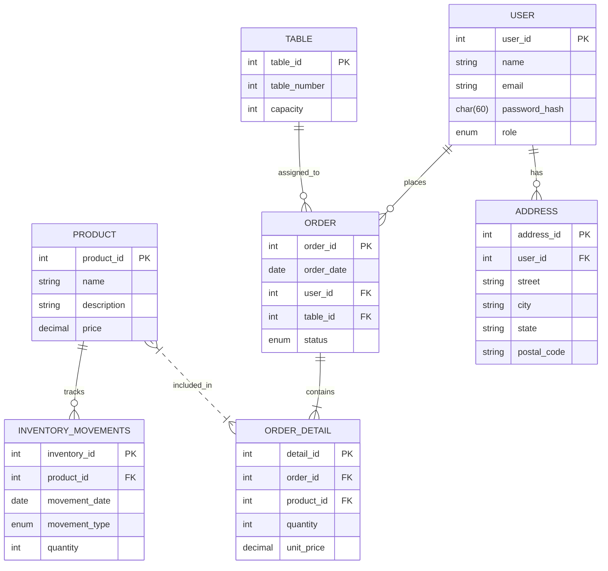

# Software Requirements Specification (SRS)
## Chicaffe — Cafeteria Management System
 
| Field | Value |
|---|---|
| **Document Version** | 1.5 |
| **Date** | May 29, 2026 |
| **Project** | Chicaffe Web |
| **Repository** | `cbtis47-db-project-salchichasparrita-2026` |
| **Prepared by** | Anderson Vázquez (Analyst & Designer) |
| **Institution** | CBTIS 47 — 2026 |
| **Status** | In Progress |
 
---
 
## Table of Contents
 
1. [Introduction](#1-introduction)
2. [General Description](#2-general-description)
3. [Actors](#3-actors)
4. [Functional Requirements](#4-functional-requirements)
5. [Non-Functional Requirements](#5-non-functional-requirements)
6. [UI/UX Requirements](#6-uiux-requirements)
7. [Data Model](#7-data-model)
8. [System Architecture](#8-system-architecture)
9. [Project Structure](#9-project-structure)
10. [API Endpoints](#10-api-endpoints)
11. [User Stories Summary](#11-user-stories-summary)
12. [Constraints and Assumptions](#12-constraints-and-assumptions)
13. [Glossary](#13-glossary)
---
 
## 1. Introduction
 
### 1.1 Purpose
 
This document specifies the software requirements for **Chicaffe**, a web-based cafeteria management system developed as an academic project at CBTIS 47. It serves as the reference for the development team, covering functional requirements, non-functional requirements, architecture, data model, and user stories.
 
### 1.2 Scope
 
Chicaffe is a full-stack web application that centralizes cafeteria operations including user authentication, product and inventory management, table administration, order processing, and sales reporting. The system is intended for use by two roles: **Administrator** and **Employee**.
 
### 1.3 Definitions and Acronyms
 
| Term | Definition |
|---|---|
| SRS | Software Requirements Specification |
| FR | Functional Requirement |
| NFR | Non-Functional Requirement |
| US | User Story |
| EP | Epic |
| SP | Story Points |
| CRUD | Create, Read, Update, Delete |
| RBAC | Role-Based Access Control |
| REST | Representational State Transfer |
| API | Application Programming Interface |
| ERD | Entity Relationship Diagram |
 
### 1.4 References
 
- Technical Summary — Chicaffe v1.1 (May 14, 2026)
- Sprint Backlog — Chicaffe · Third Partial v2.1 (May 29, 2026)
- README — Chicaffe Administration Panel
---
 
## 2. General Description
 
### 2.1 Product Overview
 
Chicaffe is a client-server web application that enables cafeteria administrators and employees to manage daily operations through a browser-based interface. The system communicates via a RESTful API backed by a Node.js/Express server and a MySQL relational database.
 
### 2.2 Product Context
 
```
┌─────────────────────────────────────────────────────────────────┐
│                        BROWSER CLIENT                           │
│              HTML5 · CSS3 · Vanilla JavaScript                  │
└─────────────────────────┬───────────────────────────────────────┘
                          │ HTTP / REST API
┌─────────────────────────▼───────────────────────────────────────┐
│                     BACKEND SERVER                              │
│                  Node.js · Express.js                           │
│         (Authentication · Business Logic · RBAC)               │
└─────────────────────────┬───────────────────────────────────────┘
                          │ mysql2 connector
┌─────────────────────────▼───────────────────────────────────────┐
│                   RELATIONAL DATABASE                           │
│                MySQL (via XAMPP · port 3306)                    │
│   users · products · orders · order_details · tables ·         │
│              inventory_movements · addresses                    │
└─────────────────────────────────────────────────────────────────┘
```
 
### 2.3 Product Features Summary
 
- User authentication with role-based access control (Administrator / Employee)
- User management (registration, search)
- Product catalogue management (CRUD)
- Inventory tracking with movement history (SALE / RESTOCK)
- Table administration (CRUD)
- Order lifecycle management (pending → in_progress → delivered → cancelled)
- Automatic inventory adjustment on order creation and cancellation
- Daily and date-range sales reports with charts
- Report export (CSV and PDF)
- Order history with search and filters
- Server-side pagination for large datasets
- Global error handling and per-field form validation
### 2.4 Operating Environment
 
- **Server OS:** Any system supporting Node.js v18+
- **Local environment:** XAMPP (Apache + MySQL)
- **Supported browsers:** Chromium-based browsers (Google Chrome, Microsoft Edge)
- **Network:** Local network or localhost; requires active internet for CDN resources (Chart.js, jsPDF)
### 2.5 Development Team
 
| Member | Role |
|---|---|
| Anderson Vázquez | Analyst & Designer |
| Jayden Reyes | SQL Developer |
| Matthew Venegas | Database Administrator |
| Axel de la Cruz | Query Master |
| Anuar Contreras | SQL Tester |
 
---
 
## 3. Actors
 
| Actor | Description | Access Level |
|---|---|---|
| **Administrator** | Full system access. Manages users, products, tables, orders, and reports. | All modules |
| **Employee** | Operational access. Manages orders and views products/tables. Cannot access user management or reports. | Orders, Products (read), Tables (read) |
 
---
 
## 4. Functional Requirements
 
### 4.1 Authentication (EP-01)
 
| ID | Description |
|---|---|
| FR-01 | The system must allow administrators to register users with name, email, and password. |
| FR-02 | The system must validate that the email is unique before creating a user. |
| FR-03 | The system must display validation messages for empty or invalid fields. |
| FR-04 | The system must authenticate users against hashed passwords stored in the database. |
| FR-05 | The system must redirect users to the dashboard after successful login. |
| FR-06 | The system must allow users to log out at any time. |
| FR-07 | Protected routes must require authentication; unauthenticated requests must be redirected to the login page. |
 
### 4.2 User Management (EP-02)
 
| ID | Description |
|---|---|
| FR-08 | The system must allow administrators to view all registered users. |
| FR-09 | The system must allow searching users by name. |
| FR-10 | The system must allow assigning a role (Administrator or Employee) when creating a user. |
| FR-11 | The system must save the role to the database and display it in the user's profile. |
 
### 4.3 Products & Inventory (EP-03)
 
| ID | Description |
|---|---|
| FR-12 | The system must allow creating, updating, and deleting products. |
| FR-13 | The system must manage inventory movements of type SALE and RESTOCK. |
| FR-14 | The system must display a visual indicator for out-of-stock products. |
 
### 4.4 Tables (EP-04)
 
| ID | Description |
|---|---|
| FR-15 | The system must allow managing tables with table number and capacity. |
 
### 4.5 Orders (EP-05)
 
| ID | Description |
|---|---|
| FR-16 | The system must allow creating orders linked to a user and a table. |
| FR-17 | The system must allow adding products to an order. |
| FR-18 | The system must manage the order lifecycle: pending → in_progress → delivered → cancelled. |
| FR-19 | The system must decrease inventory when products are added to an order. |
| FR-20 | The system must restore inventory when an order is cancelled. |
| FR-21 | The system must prevent invalid order status transitions. |
| FR-22 | The system must preserve the product price at the time of order creation (unit_price snapshot). |
 
### 4.6 Reports (EP-06)
 
| ID | Description |
|---|---|
| FR-23 | The system must generate daily sales reports based on delivered orders. |
| FR-24 | The system must support date-range filtering on reports. |
| FR-25 | The system must display a bar chart (sales by day), a pie chart (top products), and a line chart (cumulative sales trend). |
| FR-26 | The system must show a "No sales data available" message when no orders exist in the selected range. |
 
### 4.7 Order History (EP-07)
 
| ID | Description |
|---|---|
| FR-27 | The system must display all past orders with date, table, total, and status. |
| FR-28 | The system must allow searching order history by order ID, customer name, or date. |
| FR-29 | The system must display an order detail view with products, quantities, unit prices, and subtotal. |
 
### 4.8 Export (EP-07)
 
| ID | Description |
|---|---|
| FR-30 | The system must allow exporting reports as CSV files with all records and column headers. |
| FR-31 | The system must allow exporting reports as PDF files with title, generation date, and all data rows. |
| FR-32 | Export buttons must be disabled when no report has been generated. |
 
### 4.9 Role-Based Access Control — RBAC (EP-07)
 
| ID | Description |
|---|---|
| FR-33 | Employees must be denied access to user management and reports sections. |
| FR-34 | An "Access denied" message must be displayed when an employee attempts to access restricted sections. |
| FR-35 | Administrators must have full access to all features and data. |
 
### 4.10 Performance & Error Handling (EP-07)
 
| ID | Description |
|---|---|
| FR-36 | The system must apply server-side pagination for lists exceeding 500 records. |
| FR-37 | The system must display a network error message and preserve data when a request fails due to no internet connection. |
| FR-38 | The system must display per-field validation messages and keep the form populated when a form is submitted with invalid data. |
| FR-39 | The system must display a generic error message and keep the UI stable when an unhandled server-side exception occurs. |
 
---
 
## 5. Non-Functional Requirements
 
### 5.1 Performance
 
| ID | Description |
|---|---|
| NFR-01 | Any page must be fully rendered and interactive within 2 seconds under normal load. |
| NFR-02 | Data must load in under 3 seconds. |
| NFR-03 | Save operations must complete in under 2 seconds. |
| NFR-04 | Server-side pagination must limit query payload to the current page; MySQL indexes must be applied to frequently queried columns (date, user_id, status). |
 
### 5.2 Security
 
| ID | Description |
|---|---|
| NFR-05 | Passwords must be stored as bcrypt hashes (char(60)); plain-text passwords must never be stored. |
| NFR-06 | All protected routes must be validated server-side via Express middleware before granting access. |
| NFR-07 | Role checks must be enforced on the server, not only on the client. |
 
### 5.3 Reliability
 
| ID | Description |
|---|---|
| NFR-08 | The system must detect internet disconnection and notify the user without losing form data. |
| NFR-09 | The product price must be captured as a snapshot (unit_price) at order creation time; subsequent price changes must not affect existing orders. |
| NFR-10 | Internal server errors must be logged and must not crash the server process. |
 
### 5.4 Compatibility
 
| ID | Description |
|---|---|
| NFR-11 | The system must run correctly on Chromium-based browsers (Chrome, Edge). |
| NFR-12 | The system must be built using Node.js v18+, Express.js, MySQL, HTML5, CSS3, and vanilla JavaScript. |
| NFR-13 | The system must be deployable in a local XAMPP environment on port 3000. |
 
### 5.5 Maintainability
 
| ID | Description |
|---|---|
| NFR-14 | Code must be clean, well-commented, and organized according to the defined project structure. |
| NFR-15 | All source code must be version-controlled using Git and hosted on GitHub. |
| NFR-16 | Database schema, seed data, and maintenance scripts must be kept in separate .sql files under `/src`. |
 
### 5.6 Usability
 
| ID | Description |
|---|---|
| NFR-17 | The interface must be fully responsive across desktop and mobile viewports. |
| NFR-18 | Destructive actions (delete, cancel order) must require confirmation dialogs. |
 
---
 
## 6. UI/UX Requirements
 
| ID | Description |
|---|---|
| UX-01 | The system must maintain a consistent visual identity across all pages. |
| UX-02 | The layout must be fully responsive. |
| UX-03 | Navigation must use a sidebar component present on all authenticated pages. |
| UX-04 | Confirmation dialogs must appear before any destructive action (delete, cancel). |
| UX-05 | Products with zero stock must display a visual out-of-stock indicator. |
| UX-06 | All data tables must include a search bar for real-time filtering. |
 
---
 
## 7. Data Model
 
### 7.1 Entity Relationship Diagram
 

 
### 7.2 Table Descriptions
 
**USER** — Stores authentication credentials and role.
- `role`: ENUM('admin', 'employee')
- `password_hash`: bcrypt hash, char(60)
**ORDER** — Represents a customer order.
- `status`: ENUM('pending', 'in_progress', 'delivered', 'cancelled')
- Valid transitions: pending → in_progress → delivered; any status → cancelled
**ORDER_DETAIL** — Line items of an order.
- `unit_price`: snapshot of the product price at order creation time
**INVENTORY_MOVEMENTS** — Tracks stock changes.
- `movement_type`: ENUM('SALE', 'RESTOCK')
---
 
## 8. System Architecture
 
### 8.1 Technology Stack
 
| Layer | Technology | Version |
|---|---|---|
| Runtime | Node.js | v18+ |
| Framework | Express.js | Latest |
| Database | MySQL | 5.7+ / 8.0+ |
| DB Connector | mysql2 | Latest |
| Frontend | HTML5, CSS3, Vanilla JS | — |
| Charts | Chart.js | CDN |
| PDF Export | jsPDF | CDN |
| Dev Tooling | Nodemon | Latest |
| API Testing | Thunder Client / Postman | — |
| Version Control | Git + GitHub | — |
| Local Env | XAMPP | — |
 
### 8.2 Architectural Pattern
 
The system follows a **three-tier client-server architecture**:
 
**Presentation Layer** — Static HTML/CSS/JS files served from `/public`. The browser renders the UI and communicates with the backend exclusively via `fetch()` calls to the REST API.
 
**Business Logic Layer** — Express.js application in `server.js` and route handlers. This layer enforces authentication, RBAC middleware, input validation, order lifecycle rules, and inventory operations.
 
**Data Layer** — MySQL relational database accessed via `mysql2` connection pool. Indexes are applied to `order_date`, `user_id`, and `status` columns for query performance.
 
### 8.3 Key Technical Decisions
 
| Decision | Choice | Rationale |
|---|---|---|
| Chart library | Chart.js (CDN) | Lightweight, zero-dependency, compatible with vanilla JS |
| PDF export | jsPDF (CDN) | Client-side; no server overhead; direct download stream |
| CSV export | Express `res.download()` | Server-side; full dataset regardless of client pagination |
| RBAC | `role` ENUM + Express middleware | Single column; middleware intercepts routes before access |
| Performance | Server-side pagination + MySQL indexes | Limits payload to current page; keeps response under 2 s |
| Error handling | Global fetch wrapper + inline validation | Intercepts network failures; preserves input state |
 
---
 
## 9. Project Structure
 
```
cbtis47-db-project-salchichasparrita-2026/
│
├── README.md
├── INSTALL.md
├── ROLES.md
├── package.json
├── server.js
│
├── docs/
│   ├── SRS.md                    ← this document
│   ├── dictionary.md
│   ├── erd_diagram.md
│   ├── normalization_report.md
│   └── scrum/
│       └── daily/
│
├── public/
│   ├── index.html
│   ├── styles/
│   └── scripts/
│
├── src/
│   ├── 01_schema.sql
│   ├── 02_seed_data.sql
│   ├── 03_users.sql
│   └── 04_maintenance.sql
│
├── queries/
│   ├── basic_reports.sql
│   ├── report_sales.sql
│   └── analysis.sql
│
└── tests/
    ├── bug_report.md
    └── test_cases.sql
```
 
---
 
## 10. API Endpoints
 
Base URL: `http://localhost:3000`
 
| Method | Endpoint | Description | Auth Required |
|---|---|---|---|
| POST | `/api/auth/login` | Authenticate user | No |
| POST | `/api/auth/logout` | End session | Yes |
| GET | `/api/users` | List all users | Admin |
| POST | `/api/users` | Create user | Admin |
| GET | `/api/products` | List all products | Yes |
| POST | `/api/products` | Create product | Admin |
| PUT | `/api/products/:id` | Update product | Admin |
| DELETE | `/api/products/:id` | Delete product | Admin |
| GET | `/api/orders` | List orders | Yes |
| POST | `/api/orders` | Create order | Yes |
| PUT | `/api/orders/:id/status` | Update order status | Yes |
| GET | `/api/tables` | List tables | Yes |
| POST | `/api/tables` | Create table | Admin |
| PUT | `/api/tables/:id` | Update table | Admin |
| DELETE | `/api/tables/:id` | Delete table | Admin |
| GET | `/api/inventory` | List inventory movements | Admin |
| POST | `/api/inventory` | Register movement | Admin |
| GET | `/api/reports/sales` | Generate sales report | Admin |
| GET | `/api/reports/export/csv` | Export report as CSV | Admin |
| GET | `/api/reports/export/pdf` | Export report as PDF | Admin |
 
---
 
## 11. User Stories Summary
 
### Epics
 
| ID | Epic | Priority | Sprint |
|---|---|---|---|
| EP-01 | Authentication | High | Sprint 1 |
| EP-02 | User Management | High | Sprint 1 |
| EP-03 | Products & Inventory | High | Sprint 1 |
| EP-04 | Tables | Medium | Sprint 2 |
| EP-05 | Orders | High | Sprint 2 |
| EP-06 | Reports | Medium | Sprint 3 |
| EP-07 | Enhancements & Polish | Medium–High | Sprint 7 |
 
### Sprint 7 User Stories (Third Partial)
 
| US | User Story | Priority | SP |
|---|---|---|---|
| US-17 | As an Administrator, I want advanced sales reports with charts | Medium | 8 |
| US-18 | As an Administrator, I want to view order history with search and filters | Medium | 6 |
| US-19 | As an Administrator, I want role-based access control (RBAC) | High | 8 |
| US-20 | As an Administrator, I want to export reports (PDF and CSV) | Medium | 5 |
| US-21 | As a Developer, I want performance optimization | Medium | 5 |
| US-22 | As a User, I want better error handling and user feedback | Medium | 4 |
 
**Total Sprint 7: 36 SP**
 
---
 
## 12. Constraints and Assumptions
 
### Constraints
 
- The system must run in a local XAMPP environment during development.
- The frontend must use only HTML5, CSS3, and vanilla JavaScript (no frontend frameworks).
- External libraries (Chart.js, jsPDF) must be loaded via CDN.
- The system is only guaranteed to work on Chromium-based browsers.
- The project scope is defined by academic requirements at CBTIS 47.
### Assumptions
 
- MySQL is available on port 3306 via XAMPP.
- The database is named `restaurant_db`.
- Node.js v18 or higher is installed on the development machine.
- Team members have Git and GitHub access.
- Internet connection is available during development for CDN resources.
---
 
## 13. Glossary
 
| Term | Definition |
|---|---|
| **Order lifecycle** | The sequence of statuses an order passes through: pending → in_progress → delivered (or cancelled at any point). |
| **Unit price snapshot** | The product price recorded in `order_detail.unit_price` at the moment of order creation, independent of future price changes. |
| **RBAC** | Role-Based Access Control. Restricts system sections based on the authenticated user's role (admin or employee). |
| **Inventory movement** | A record of stock change. Type SALE decreases stock; type RESTOCK increases stock. |
| **Story Point (SP)** | A relative unit used in Scrum to estimate the effort required to implement a user story. |
| **Definition of Done** | The team's agreed checklist that a user story must satisfy before it is considered complete. |
 
---
 
*Document generated for academic use — CBTIS 47 · 2026*
