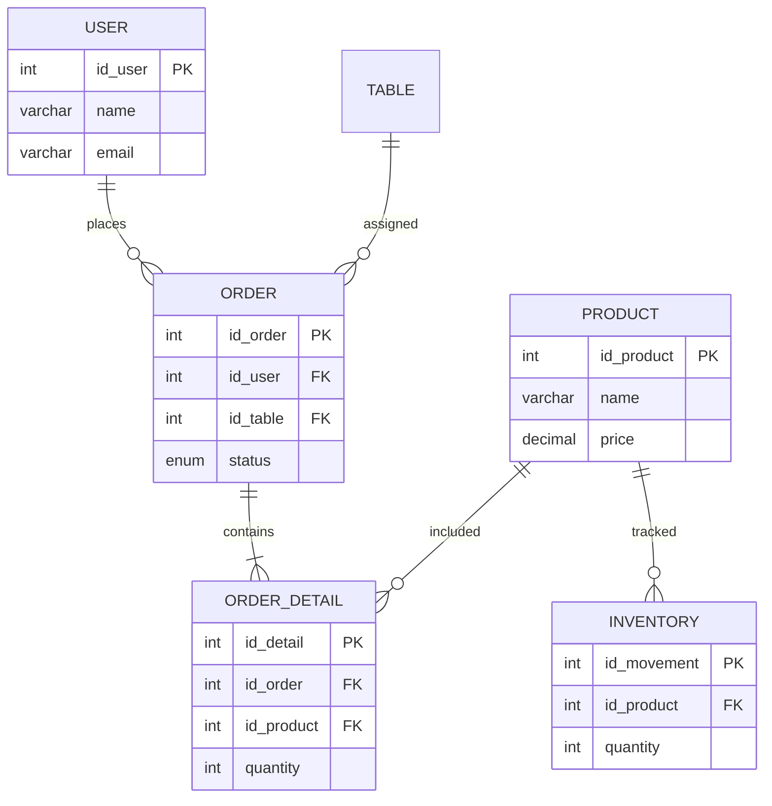

# Technical Summary — Chicaffe

## 1. Functional Requirements (Agile & UI/UX)

Functional requirements describe **what the system must do**.

### 1.1 Authentication
**FR-01.** Register users  
**FR-02.** Unique email validation  
**FR-03.** Empty field validation  
**FR-04.** Supabase Auth login  
**FR-05.** Redirect to dashboard  
**FR-06.** Logout  
**FR-07.** Protected routes  

### 1.2 User Management
**FR-08.** View users  
**FR-09.** Search users  

### 1.3 Product & Inventory
**FR-10.** CRUD products  
**FR-11.** Inventory movements  
**FR-12.** Out of stock indicator  
**FR-13.** Prevent sales without stock  

### 1.4 Tables
**FR-14.** Manage tables  

### 1.5 Orders
**FR-15.** Create orders  
**FR-16.** Add products  
**FR-17.** Order lifecycle  
**FR-18.** Decrease inventory  
**FR-19.** Restore inventory  
**FR-20.** Prevent invalid transitions  

### 1.6 Reports
**FR-21.** Daily sales report  

---

## 2. Agile Requirements
**AG-01.** Sprints  
**AG-02.** User Stories format  
**AG-03.** Gherkin criteria  
**AG-04.** Story Points  
**AG-05.** GitHub version control  

---

## 3. UI/UX
**UX-01.** Consistency  
**UX-02.** Responsive  
**UX-03.** Sidebar  
**UX-04.** Confirm actions  
**UX-05.** Out-of-stock indicator  
**UX-06.** Search  

---

## 4. Non-Functional
**NFR-01.** Load < 3s  
**NFR-02.** Save < 2s  
**NFR-03.** Secure auth  
**NFR-04.** Detect offline  
**NFR-05.** Price history  
**NFR-06.** HTML/CSS/JS/Supabase only  
**NFR-07.** Chromium only  

---

## 5. Product Backlog

### 🎯 Goal
Centralize cafeteria operations.

### 📦 Epics
| ID | Epic | Priority |
|---|---|---|
| EP-01 | Auth | High |
| EP-02 | Users | High |
| EP-03 | Inventory | High |
| EP-04 | Tables | Medium |
| EP-05 | Orders | High |
| EP-06 | Reports | Medium |

---

## 6. Gherkin

```gherkin
Feature: Authentication
Scenario: Register
  Given valid data
  When submitted
  Then user created

Scenario: Login
  Given correct credentials
  Then access granted

Scenario: Logout
  Then session ends

Feature: Users
Scenario: View
  Then show users

Scenario: Search
  Then filter users

Feature: Inventory
Scenario: Restock
  Then increase stock

Scenario: No stock
  Then block sale

Feature: Orders
Scenario: Create
  Then pending

Scenario: Cancel
  Then restore stock

Feature: Reports
Scenario: Daily sales
  Then sum delivered
```

---

## 7. Data Structure



---

## 8. Development Team

| Name             | Role    |
| ---------------- | ------- |
| Anderson Vazquez | Analyst |
| Jayden Reyes     | SQL Dev |
| Matthew Venegas  | DBA     |
| Axel de la Cruz  | Query   |
| Anuar Contreras  | Tester  |

---

## 9. Scope

### In
- Auth
- Orders
- Inventory
- Reports

### Out
- Mobile app
- Payments

---

## 10. Next Steps
- Improve validation
- Handle concurrency
- Add edge cases

---

**Chicaffe — CBTis 47 · 2026**
