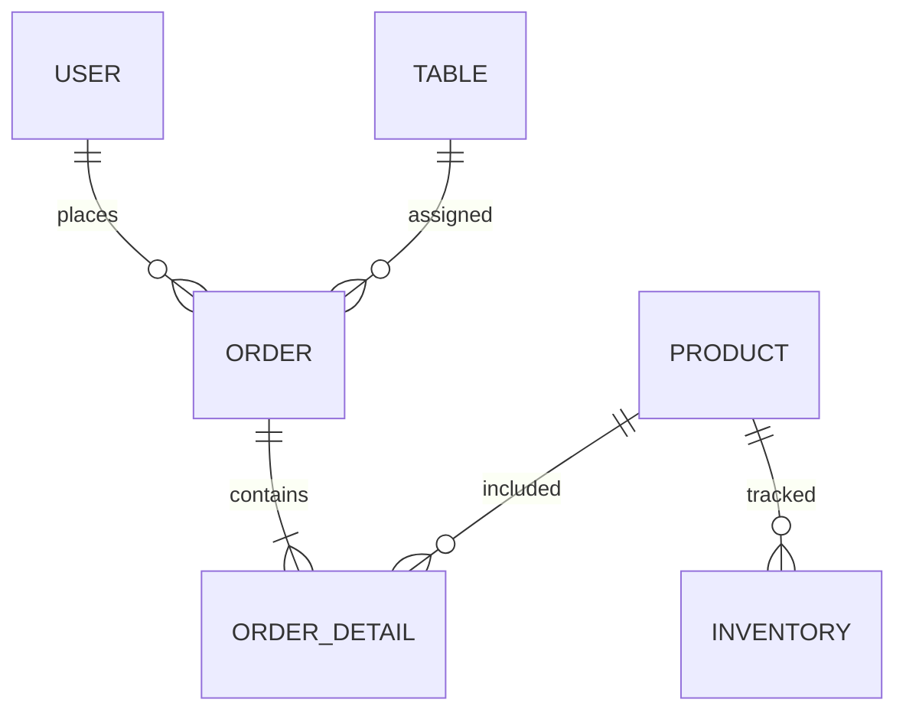

# Technical Summary — Chicaffe

## 1. Functional Requirements (Agile & UI/UX)

Functional requirements describe **what the system must do**.

### 1.1 Authentication
**FR-01.** The system must allow administrators to register users with name, email, and password  
**FR-02.** The system must validate that the email is unique  
**FR-03.** The system must display validation messages for empty fields  
**FR-04.** The system must authenticate users using Supabase Auth  
**FR-05.** The system must redirect users to the dashboard after login  
**FR-06.** The system must allow logout at any time  
**FR-07.** Protected routes must require authentication  

### 1.2 User Management
**FR-08.** The system must allow administrators to view all users  
**FR-09.** The system must allow searching users by name  

### 1.3 Product & Inventory
**FR-10.** The system must allow creating, updating, and deleting products  
**FR-11.** The system must manage inventory movements (SALE / RESTOCK)  

### 1.4 Tables
**FR-14.** The system must allow managing tables (number and capacity)  

### 1.5 Orders
**FR-15.** The system must allow creating orders linked to a user and table  
**FR-16.** The system must allow adding products to an order  
**FR-17.** The system must manage order lifecycle (pending → in_progress → delivered → cancelled)  
**FR-18.** The system must decrease inventory when products are added  
**FR-19.** The system must restore inventory when an order is cancelled  
**FR-20.** The system must prevent invalid order status transitions  

### 1.6 Reports
**FR-21.** The system must generate daily sales reports based on delivered orders  

---

## 2. Agile Requirements
**AG-01.** The project must be organized into Sprints  
**AG-02.** User Stories must follow the format: *As a [user], I want to [action], so that [benefit]*  
**AG-03.** Each User Story must include Gherkin acceptance criteria  
**AG-04.** Each User Story must have Story Points  
**AG-05.** Code must be version-controlled with GitHub  

---

## 3. UI/UX
**UX-01.** Consistent visual identity  
**UX-02.** Responsive design  
**UX-03.** Sidebar navigation  
**UX-04.** Confirmation for destructive actions  
**UX-05.** Visual indicator for out-of-stock products  
**UX-06.** Search bar in tables  

---

## 4. Non-Functional
**NFR-01.** Data must load in under 3 seconds  
**NFR-02.** Save operations must complete in under 2 seconds  
**NFR-03.** Passwords must be securely handled by Supabase Auth  
**NFR-04.** The system must detect internet disconnection  
**NFR-05.** Product price must be preserved at order time  
**NFR-06.** The system must use only HTML, CSS, JS, and Supabase  
**NFR-07.** The system must run on Chromium browsers  

---

## 5. Product Backlog

### 🎯 Goal
Centralize cafeteria operations and reduce manual errors.

### 📦 Epics

| ID | Epic | Priority |
|---|---|---|
| EP-01 | Authentication | High |
| EP-02 | User Management | High |
| EP-03 | Products & Inventory | High |
| EP-04 | Tables | Medium |
| EP-05 | Orders | High |
| EP-06 | Reports | Medium |

---

## 6. Gherkin

```gherkin
Feature: Authentication

Scenario: Successful registration
  Given the admin is on the registration form
  When valid user data is submitted
  Then the system creates a new user account

Scenario: Registration fails due to duplicate email
  Given an existing email in the system
  When the admin submits the form
  Then the system displays an error message

Scenario: Successful login
  Given a registered user
  When correct credentials are entered
  Then access is granted and redirected to dashboard

Scenario: Logout
  Given an active session
  When the user logs out
  Then the session is terminated


Feature: User Management

Scenario: View users
  When the admin accesses user list
  Then all users are displayed

Scenario: Search users
  Given a search input
  When typing a name
  Then filtered results are shown


Feature: Inventory

Scenario: Restock product
  Given a product exists
  When restock is registered
  Then inventory increases

Scenario: Prevent sale without stock
  Given a product with zero stock
  When attempting to add to order
  Then the system blocks the action


Feature: Orders

Scenario: Create order
  Given a user and table selected
  When order is created
  Then status is set to pending

Scenario: Add products to order
  Given available stock
  When products are added
  Then inventory decreases

Scenario: Cancel order
  Given an existing order
  When it is cancelled
  Then inventory is restored

Scenario: Invalid status transition
  Given an order delivered
  When attempting to revert status
  Then the system denies the action


Feature: Reports

Scenario: Generate daily sales report
  Given delivered orders exist
  When report is generated
  Then total sales are calculated

  ---
 
## 7. Data Structure
 

 
---
 
## 8. Development Team
 
| Name             | Role    |
| ---------------- | ------- |
| Anderson Vazquez | Analyst |
| Jayden Reyes     | SQL Dev |
| Matthew Venegas  | DBA     |
| Axel de la Cruz  | Query   |
| Anuar Contreras  | Tester  |
 
---
 
## 9. Scope
 
### In
- Auth
- Orders
- Inventory
- Reports
### Out
- Mobile app
- Payments
---
 
## 10. Next Steps
- Improve validation
- Handle concurrency
- Add edge cases
---
 
**Chicaffe — CBTis 47 · 2026**
